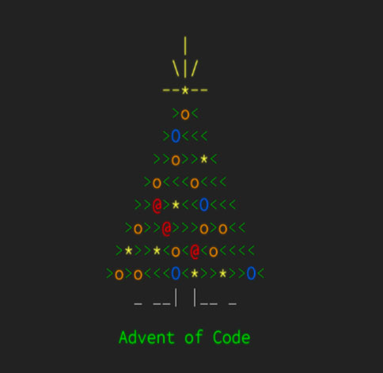

# Решения задач с [Advent of Code](http://www.adventofcode.com)
Репозиторий, где я пытаюсь решать ~~решаю~~ задачи с [Advent of Code](http://www.adventofcode.com)

[2015](2015) 

✅ ✅ ✅ ✅ ✅ ✅ ✅ ❌ ❌ ❌ ❌ ❌ ❌ ❌ ❌ ❌ ❌ ❌ ❌ ❌ ❌ ❌ ❌ ❌ ❌

[2016](2016) 

❌ ❌ ❌ ❌ ❌ ❌ ❌ ❌ ❌ ❌ ❌ ❌ ❌ ❌ ❌ ❌ ❌ ❌ ❌ ❌ ❌ ❌ ❌ ❌ ❌

[2017](2017) 

❌ ❌ ❌ ❌ ❌ ❌ ❌ ❌ ❌ ❌ ❌ ❌ ❌ ❌ ❌ ❌ ❌ ❌ ❌ ❌ ❌ ❌ ❌ ❌ ❌

[2018](2018) 

❌ ❌ ❌ ❌ ❌ ❌ ❌ ❌ ❌ ❌ ❌ ❌ ❌ ❌ ❌ ❌ ❌ ❌ ❌ ❌ ❌ ❌ ❌ ❌ ❌

[2018](2018) 

❌ ❌ ❌ ❌ ❌ ❌ ❌ ❌ ❌ ❌ ❌ ❌ ❌ ❌ ❌ ❌ ❌ ❌ ❌ ❌ ❌ ❌ ❌ ❌ ❌

[2020](2020)  

❌ ❌ ❌ ❌ ❌ ❌ ❌ ❌ ❌ ❌ ❌ ❌ ❌ ❌ ❌ ❌ ❌ ❌ ✅ ❌ ❌ ❌ ❌ ❌ ❌

[2021](2021) 

❌ ❌ ❌ ❌ ❌ ❌ ❌ ❌ ❌ ❌ ❌ ❌ ❌ ❌ ❌ ❌ ❌ ❌ ❌ ❌ ❌ ❌ ❌ ❌ ❌

[2022](2022) 

❌ ❌ ❌ ❌ ❌ ❌ ❌ ❌ ❌ ❌ ❌ ❌ ❌ ❌ ❌ ❌ ❌ ❌ ❌ ❌ ❌ ❌ ❌ ❌ ❌

[2023](2023) 

✅ ✅ ✅ ☑️ ☑️ ❌ ✅ ✅ ✅ ✅ ☑️ ❌ ❌ ❌ ❌ ❌ ❌ ❌ ❌ ❌ ❌ ❌ ❌ ❌ ☑️

[2024](2024) 

✅ ✅ ✅ ✅ ✅ ☑️ ✅ ❌ ✅ ✅ ❌ ✅ ❌ ❌ ❌ ❌ ❌ ❌ ❌ ❌ ❌ ❌ ❌ ❌ ❌

✅ - задача решена полностью

☑️ - решена первая часть

❌ - не решена ни одна часть

Общий прогресс: 

